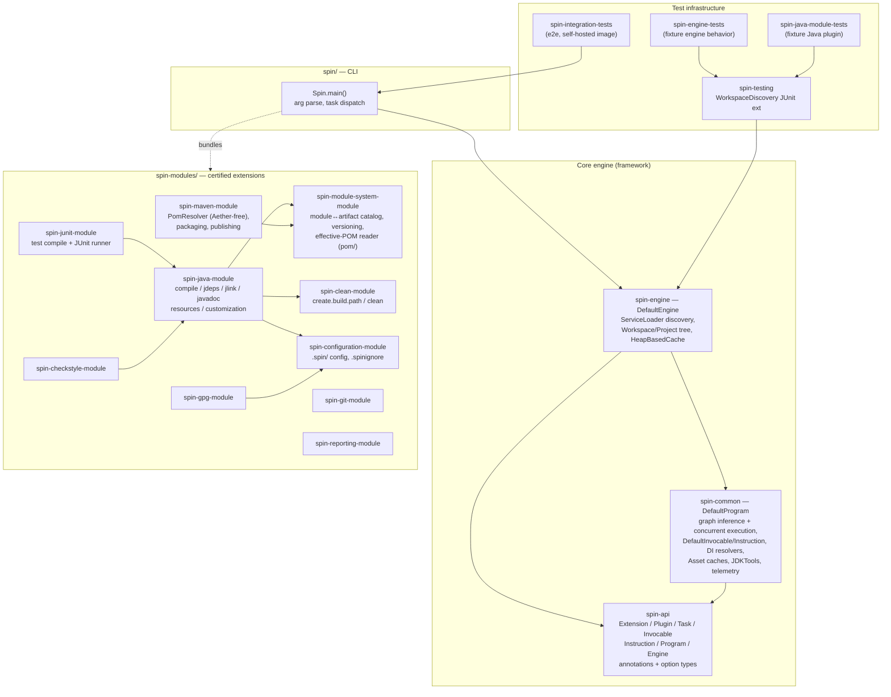

# Codebase Map

> Auto-generated by Cartographer. Last mapped: 2026-09-07
>
> Companion docs: [CONCEPTS.md](CONCEPTS.md) (the vocabulary — Project, Task, Invocable,
> Instruction, Program), [CROSS_TARGET_JDKS.md](CROSS_TARGET_JDKS.md).

## System Overview

**spin** is a script-free Java 25 build system. It infers what to build by inspecting project
structure via pluggable `Extension`s discovered through JPMS `ServiceLoader`, then executes a
dependency-ordered graph of `Task`s. Extensions auto-detect applicability, declare task
dependencies via annotations (`@From`, `@After`, `@Before`, `@PreProcess`, `@PostProcess`), and
are composed via a DI framework (`build.codemodel.dependency.injection`, Jakarta-compatible). No
build scripts are required — directory shape (`src/main/java`, `pom.xml`, `.git`, `.spinignore`)
drives everything.

spin is **self-hosting**: Maven builds spin₁, spin₁ jlinks spin₂, spin₂ jlinks spin₃, and CI
asserts spin₂ ≡ spin₃ (structural reproducibility) during the `prepare-package` phase.

**Two things called "spin":** *spin-the-framework* (`spin-api`, `spin-engine`, `spin-common`) is a
language-agnostic orchestration engine; *spin-the-binary* (`spin/` + all `spin-modules/`) is an
opinionated Java/Maven build tool shipped as a jlink image with a fixed, certified extension set.



External libraries (sibling repos, read from source per CLAUDE.md): `build.base.*` (version,
config, commandline, flow, foundation), `build.codemodel.*` (DI framework, JDK module model),
`build.spawn.*` (process/JDK launching), `build.percolate.core` (now hosts `ModuleGraphClassifier`).

---

## Directory Structure

```
spin.build/
├── spin-api/                  Public contract — interfaces, annotations, option types. JPMS: build.spin
├── spin-common/               DefaultProgram (infer+execute), DefaultInvocable/Instruction,
│                              DI resolvers, Asset caches, JDKTools/ProcessRunner, telemetry. build.spin.common
├── spin-engine/               DefaultEngine (ServiceLoader discovery), Workspace/Project tree,
│                              FederatedWorkspace, HeapBasedCache. build.spin.engine
├── spin/                      Spin.main() CLI + jlink packaging + self-hosting bootstrap. build.spin.application
├── spin-modules/
│   ├── spin-java-module/          javac/jdeps/jlink/javadoc, resources, Build.java customization. build.spin.module.java
│   ├── spin-module-system-module/ module↔artifact catalog + versioning + pom/ (effective-POM reader). …modulesystem
│   ├── spin-maven-module/         PomResolver (pure-JDK artifact resolution), jar/pom packaging, publish. …maven
│   ├── spin-junit-module/         test compile + JUnit Platform ConsoleLauncher (Java 8 & 25). …junit
│   ├── spin-configuration-module/ .spin/ hierarchical config, @Configuration injection, .spinignore. …configuration
│   ├── spin-clean-module/         create.build.path (ubiquitous @From target) + clean. …clean
│   ├── spin-checkstyle-module/    Checkstyle runner, fails build on violations. …checkstyle
│   ├── spin-gpg-module/           GPG detached signing (opt-in `spin sign`). …gpg
│   ├── spin-git-module/           .git workspace-root detection only. …git
│   ├── spin-reporting-module/     @Automatic 3D-force-graph HTML task-graph report. …reporting
│   ├── spin-engine-tests/         fixture-based engine/program behavior tests (test-only module)
│   └── spin-java-module-tests/    fixture-based Java-plugin tests (test-only module)
├── spin-testing/              WorkspaceDiscovery JUnit 5 extension. build.spin.testing
├── spin-integration-tests/    end-to-end tests driving the self-hosted spin.sh image
├── fixtures/                  Maven ground-truth fixtures for test-fixtures.sh (NOT part of this map)
├── docs/                      CONCEPTS.md, CODEBASE_MAP.md, CROSS_TARGET_JDKS.md, …
├── config/                    checkstyle.xml, IntelliJ code style
├── pom.xml                    Root multi-module POM (revision 0.4.1-SNAPSHOT, Java 25)
├── module-catalog.properties  module-name → Maven G:A:T:C:version-range (~90 entries)
├── version.properties         module-name glob → version
├── coding-conventions.md      Google Java Style + spin rules
├── install-dev.sh             Extract host jlink image to ~/.spin, symlink `spin`
├── test-all.sh / test-fixtures.sh   cross-repo and fixture smoke tests
└── .github/workflows/         main-pull-request, publish-snapshot, release, release-jlink
```

---

## Concept Model (see CONCEPTS.md for the full treatment)

- **Extension** — anything pluggable, found once at startup via `ServiceLoader` on
  `build.spin.Extension$MetaClass`. Five kinds by scope × lifecycle:
  **Service** (workspace-wide, e.g. `MavenRepository`, `JavaPlatform`), **Resource** (per-project,
  cascades to children, can mark ignored/workspace paths), **Server**/**Daemon** (background
  process variants — contracts only, nothing ships), **Plugin** (per-project, declares `Task`s).
- **Task\<T>** — one unit of work. **Must be a `public static` non-abstract inner class of a
  `Plugin`** or it is silently undiscovered. Body is a reflected public method whose params are
  DI-resolved; `Task<Void>` is a `void`-returning method.
- **Invocable** — pre-execution metadata for a Task class in a Project (`DefaultInvocable`).
- **Reference** — immutable `(Project, Task class)` + derived Plugin class; cache key + dependency
  list element. Equality by names, not instances.
- **Instruction** — an Invocable with its real graph edges resolved once it's in a Program
  (`DefaultInstruction`). Sorts edges into `dependencies()` (`@From` + `@Before`/`@After`, for the
  graph), `requiredDependencies()` (the *forcing* subset: `@From` + programmatic
  `Task#dependencies()` + codependencies' forced deps), `codependencies()`
  (`@PreProcess`/`@PostProcess`), `dependents()`.
- **Program** — the fully-resolved batch for a `Task.Pattern` (`DefaultProgram`). Two phases:
  **inference** (constructor: DFS from pattern-matching invocables over `requiredDependencies`,
  add `@Automatic`, build the `Reference→Reference` graph, detect cycles) and **execution**
  (`execute(AssetCache)`: `StructuredTaskScope` dispatches zero-pending instructions concurrently;
  a fair `Semaphore` bounds concurrent task *bodies*; failures are collected and rethrown at the
  end).
- **Asset / AssetCache** — immutable task result keyed by `Reference`; `NearAssetCache` layers this
  program's results over a prior program's (same CLI invocation).
- **Telemetry** — spin's *only* output mechanism (no logging framework). Typed events
  (`Information`, `Warning`, `Error`, `Diagnostic`, `Progress`, …) via a per-Engine/Program/Task
  `TelemetryRecorder` (`TelemetryPublisher`) → `Engine.publish` → subscribers (the CLI renders to
  stderr).

### The three dependency annotations (most common confusion)

| Annotation | On | Meaning |
|---|---|---|
| `@From(X.class)` | a task-method **parameter** | Real data dependency. X runs first, its `Asset` is injected. **The only annotation that forces X into the Program.** Abstract/interface target ⇒ parameter must be `Stream<T>`, unless X is `@Merge` (then a `static T merge(Stream<T>)` combines implementor results). |
| `@Before(X)` / `@After(X)` | a task **class** | Ordering only — "if we both run anyway, this order." Never pulls X in. |
| `@PreProcess(X)` / `@PostProcess(X)` | a task **class** | Codependency: always runs, **inline** as a wrapper step around X's body, never independently scheduled, result private. Resolved transitively. |

Programmatic forcing: override `Task#dependencies()` to return `Reference`s computed from runtime
info (used for cross-project compile ordering derived from the module graph).

---

## Module Guide

### `spin-api` — Public Contract (`build.spin`)

Interfaces, annotations, exceptions, option value-types. Almost no behavior (exception: default
methods on `Task`/`Invocable`/`Workspace` that do reflection/DI/cleanup). `requires transitive`
re-exports `build.base.commandline/configuration/flow/foundation`, the codemodel DI framework, and
`jakarta.inject`, so implementers get config/DI/telemetry primitives for free. Exports
`build.spin`, `build.spin.annotation`, `build.spin.option`.

Key types: `Extension` (+ nested `MetaClass` = detection logic + CLI option classes),
`Plugin`/`Resource`/`Service`/`Server`/`Daemon`, `Task<T>`, `Invocable<T>`, `Reference`,
`Instruction<T>`, `Program`, `Engine` (`createWorkspace(Path)` / `createWorkspace(List<Path>)` for
federation — throws if roots overlap — and `createProgram`), `Project` (path, hierarchy, plugins,
resources, invocables, `isIgnored` must be monotonic w.r.t. parent), `Workspace` (root Project,
`AutoCloseable`), `Asset<T>`, `AssetCache`, `Cache<K,V>`, `SpinURI`, `Visitor<T>`.

Annotations (`build.spin.annotation`): the three dependency annotations above, plus `@Merge`,
`@Automatic` (in every Program), `@NoCache` (opt out of cross-Program caching — on by default),
`@Category`/`@Categories` (extra name a `Task.Pattern` matches — drives `spin test`), `@Named`,
`@Description` (CLI help, cosmetic), `@SpecifiedBy` (override the `Invocable` impl), `@Bootstrap`
(Service established before project discovery), `@System` (Jakarta qualifier for the
system-detected value).

Option types (`build.spin.option`, all `build.base.configuration.Option`): `BuildDirectoryName`
(`.build`), `TargetDirectoryName` (`target`), `EngineVersion` (from spin's own JPMS module descriptor),
`ExecutionSlots` (`availableProcessors()`; invalid `spin.execution.slots` fails the build),
`JlinkTargets` (`ALL_STAGED` default / `HOST_ONLY`), `NetworkAccess` (`ONLINE` default /
`OFFLINE`), `OperatingSystem`, `ReuseExternalBuildOutput` (`DISABLED` default),
`Root` (repeatable — extra federated physical root), `ServerMode`, `ServerPort` (`8686`),
`Verbose`.

### `spin-common` — Engine Implementation (`build.spin.common`)

The reference implementation of the `spin-api` contracts.

- **`DefaultProgram`** — inference in the constructor (build graph, `GraphCycles.findCycle` records
  a cycle to throw later), effectful execution in `execute()`. Execution: top-level
  `StructuredTaskScope` seeds zero-dependency instructions; completing a task decrements
  successors' pending counts and forks newly-ready ones into a fresh *nested* scope owned by the
  forking thread. A **fair `Semaphore` (`executionSlots`)** bounds concurrent task bodies — the
  slot is released in a `finally` **scoped to the body only**, not the method, because the thread
  then forks dependents and blocks in `join()` (holding the slot there deadlocks wide graphs).
  Failures are collected in a `ConcurrentLinkedQueue` and rethrown (first, rest suppressed) after
  `join()`; once non-empty, no *new* tasks dispatch but in-flight ones finish. Root tasks are
  forked unconditionally (gating them raced a fast-failing sibling).
- **`DefaultInstruction`** — recursive codependency resolution with cycle guard; `ultimateOwner`
  folds an ordering constraint declared on a nested codependency onto the top-level task that owns
  an `Instruction`; a codependency's own `@From` deps *are* wired as real graph edges from the
  owning instruction.
- **`DefaultInvocable`** — immutable `(Project, Plugin, Task class)`; value equality.
- **Asset caching** — `DefaultAsset` (non-null), `VoidAsset` (`get()` throws), `DefaultAssetCache`
  (`ConcurrentHashMap`, `putIfAbsent`), `NearAssetCache` (front = this program, read-only back =
  prior program).
- **DI resolvers** — `FromResolver` (`@From`: handles `Optional<T>`, `Stream<T>`, plain `T`,
  `Asset<T>` wrappers, `@Merge` via reflective `merge`, and an ad-hoc `@From(CurrentTask.class)`
  `Capture<T>` for `@PostProcess` result rewriting). `ProjectResourceResolver` (walks
  `project.hierarchy()` for `Resource`s) — **must be registered last** in any resolver chain
  because it always satisfies `Optional<X>`, else it swallows `Optional<Boolean>`/`Optional<String>`
  config injections.
- **`task/`** — `AbstractCopy`, `DetectSourcePaths` (`@Merge` `Task<Map<SourcePathKind,PathSet>>`),
  `AbstractDetectSourcePaths`, `SourcePathKind` enum (`MAIN`, `TEST`, `GENERATED` — analysis only,
  never re-fed to compilation; `EXTERNAL_GENERATED` — protobuf/ANTLR, always fed),
  `BuildOutputLocations` (resolves spin `.build/`, Maven `target/`, Gradle `build/` output dirs by
  freshest mtime).
- **`util/` + telemetry** — `TelemetryPublisher` (the `TelemetryRecorder` impl; `commence` →
  `Activity`/`Meter` for progress), `TelemetryFiltering` (centralizes "what's noise by default"),
  `JDKTools` (`canRunInProcess` compares *real JDK home paths* not major versions; `runInProcess`
  runs a `ToolProvider` with line-based telemetry identical to the forked path),
  `ProcessRunner.await` (single "wait then fail loudly" funnel), `ProcessFailedException`
  (carries `output()` separately; `unwrap` finds it in a cause chain), `Invocables`
  (task discovery by reflection, URI construction, `Invocable` impl selection),
  `Globs.toPattern`, `TextualPositions`, `annotation/Ordered` (`@Ordered` → an `Invocable` that
  adds an automatic dependency on the same task in the preceding `Plugin.Comparable`, e.g. Java 8
  compile before Java 25).

### `spin-engine` — Discovery & Tree (`build.spin.engine`)

**`DefaultEngine`** (the one substantial class) — constructed with a `ClassLoader`, `FileSystem`,
bootstrap `Configuration`, optional `CommandLineParser`, raw args, optional telemetry consumer.
Builds its own `InjectionFramework`/`Context` (nested `EngineModule` record so tests can override
bindings). **Three `ServiceLoader` passes:** (1) `@Bootstrap` `Service.MetaClass`es detected
against the `FileSystem`; (2) non-`@Bootstrap` services; (3) all other meta-classes
(`Plugin`/`Resource`) — meta-class only, instances created lazily per project. DI context
hierarchy: engine root → per-MetaClass → per-Extension → per-Project.

**Tree construction:** `getWorkspacePath` walks *up* (a dir is the workspace if any
`Resource.MetaClass.isWorkspace` — `.git`, `.spinignore` — else the highest ancestor with a
detected `Plugin`). `createProject` walks *down* depth-first; attaches `Resource`s **before**
registering `ProjectResourceResolver` (or an ancestor's resource satisfies this project's own),
then `Plugin`s, then derives `Invocable`s. `isBuildOutputDirectory` skips `target/` only beside a
`pom.xml` and `build/` only beside a `build.gradle(.kts)` — **never by name alone**, because
`build` is a package segment in this very codebase.

**`FederatedWorkspace`** — `createWorkspace(List<Path>)` with disjoint roots builds a synthetic
parentless root whose children are each physical root's tree; `workspace().stream()` yields the
union. `requireDisjoint` rejects overlap/nesting/duplication.

**`AbstractProject`** — all Project state + stack-based DFS `walk`/`stream`; two `Memoizer` caches
(invocables by assignable Task class; codependencies by target Task class), safe because
`invocables` is frozen after discovery. `DefaultProject`/`DefaultWorkspace` are thin subclasses.

**`HeapBasedCache`** — generic thread-safe `Cache<K,V>`: entry map + per-key `ReentrantLock` map
with a stable-lock retry loop; `clear()` eagerly materializes keys (lazy streaming skipped
entries — a regression fix).

### `spin` — CLI (`build.spin.application`)

`requires transitive` every core module and every `build.spin.module.*` plugin (so the jlink image
bundles them). `Spin.main`:
1. `buildParser()` — `Command.create("spin")`; a **hand-maintained** list of command classes
   registered for help/parsing (a new first-class task name must be added here), plus `@Category`
   aliases derived reflectively (`deriveAliases`), plus global options.
2. `--engine-version` → print & exit; else print `banner.txt`.
3. `createEngine()` — fill defaults (`JDKVersion.current()`, `OperatingSystem.detect()`,
   `EngineVersion.autodetect()`), resolve `--working-dir`, dump bootstrap options, construct
   `DefaultEngine` with a stderr telemetry subscriber. Pre-engine output uses `Spin.log(...)`
   formatted identically to `Telemetry`.
4. `discover()` — `createWorkspace(path)` or, with `--root` values, `createWorkspace(List)`;
   `workspace.getProject(cwd)`; log the tree + sorted available task names.
5. Dispatch: `ServerMode.ENABLED` → `runServerMode()` (collect `BackgroundProcessor`s,
   `onInitialize`/`start`, wait on a termination barrier — but no `Server`/`Daemon` ships, so this
   is effectively inert today); else `executeTasks()` — per requested
   name `Task.Pattern.of(name)` → `createProgram` → `execute(shared)` against one shared
   `DefaultAssetCache` so later task names reuse earlier results. `ProgramExecutionException` →
   stack trace + `System.exit(-1)`.

### `spin-java-module` — Java Toolchain (`build.spin.module.java`)

The largest module. Registers five meta-classes:

- **`JavaPlatform`** (`Service`) — discovers installed JDKs via `build.spawn` `JDKDetector` (glob
  rules in `src/main/resources/java.development.kit.properties`), keyed by version+OS+arch;
  `getVersion`, `targets()`, `hostTarget()`, `isJavaPlatformModule` (`java.`/`jdk.` prefix),
  `JAVA_HOME` tie-breaker among equal versions.
- **`Java8CompilerPlugin` / `Java25CompilerPlugin`** — detected on `src/main/java` when the system
  default JDK matches the major, or on `src/main/java8` / `src/main/java25`.
- **`CustomizationPlugin`** — detected on `src/build/java/Build.java` or a root `Build.java`.
- **`ResourcePlugin`** — detected when a compiler plugin is present and `src/main/resources` exists.

Compiler-plugin tasks (`@Named`): `detect.source.paths`, `detect.compilation.resolution`,
`compile` (`@Category compile/build`, `@Ordered`; `copy.module.resources` is
`@PreProcess`'d onto it), `javadoc` (`@Category document/build`, `@After compile`), and — Java 25
only — `jdeps` (`@Named jdeps`), `jlink` (`@Named jlink`). `ResourcePlugin`:
`detect.module.resource.paths`, `copy.module.resources`.

- **Compilation** (`AbstractCompile`) — shared javac-argfile building feeds both the in-process
  path (`ToolProvider`, when the target version == running JVM and `JDKTools.canRunInProcess`) and
  the forked path (`LocalMachine.launch`). Named-module mode (`--module-path` + `-classpath`) when
  `module-info.java` is present, else one flat `-classpath`. Non-default versions compile to
  `target-<major>/` then move to `META-INF/versions/<major>/`. Verbose javac output → telemetry
  activities; stderr triaged by `ErrorCapture`.
- **Reuse short-circuit** — `AbstractDetectResolution.resolveCompiledOutput` looks for existing
  output (spin `.build/`, and only when `ReuseExternalBuildOutput.ENABLED` Maven `target/classes`
  / Gradle output, freshest by mtime); if it `containsCompiledClasses` and `isUpToDate` vs every
  source, javac is skipped. `containsCompiledClasses` excludes `META-INF/versions/` and non-`.class`
  files (distinguishes a resources-only dir from real output — matters for the self-hosting race).
- **Resolution** (`AbstractDetectResolution`) — walk the descriptor's `requires`; each is a
  workspace sibling (add its output, enqueue its requires) or external → `resolveExternalArtifact`
  (version via catalog-wins-over-bytecode-hint) → `resolveTransitive`; then `correctPinnedVersions`,
  `dedupeByMavenCoordinate` (keep highest via `VersionOrder.MAVEN`), then
  `ModuleGraphClassifier.classify`. `Task#dependencies()` (via
  `siblingCompileDependencies`) forces the `Compile` task of every required workspace sibling that
  isn't already built on disk. TEST scope adds the project's own MAIN output + infrastructure
  artifacts (a `Set<Artifact>` multibinding).
- **Annotation processing** — `AnnotationProcessorPaths` builds `--processor-module-path` /
  `-processorpath` from sibling projects that `provides javax.annotation.processing.Processor` (+
  closure) and external `requires static` modules; those siblings become forced deps. Active
  processor ⇒ `EXTERNAL_GENERATED` roots are *not* merged into sources (`FilerException`); output
  goes to `.build/main/generated-sources`.
- **jdeps** (`AbstractJavaDependencyAnalysis`) — walks the module graph, version-resolving
  non-platform requires; two dedupe passes (Maven coordinate — catches the `slf4j.api`→`org.slf4j`
  rename — then JPMS name, highest version); automatic jars → classpath, proper/required → staged
  `modules/` after `ModuleGraphClassifier.resolveConflicts`; `jdeps --list-deps
  --ignore-missing-deps --multi-release <major>`.
- **jlink** (`AbstractJavaLinker`) — skips silently if no `void main(`. One image per
  `JavaPlatform.targets()` (staging a foreign JDK is enough; `--jlink-host-only` restricts to
  host). Reads target `jmods/` names by filename (`.jmod` can't be opened at runtime) via
  `JmodModuleFinder`; runs jlink from a host-executable JDK. App modules that are automatic (or
  transitively require one) are "tainted" and stay on an external `--module-path` (`modules/`);
  the rest are packed into `lib/modules` via `--add-modules`. `stripForeignNatives` rewrites jars
  dropping foreign `os/arch` native entries into a *sibling* staging dir. **CDS**:
  `dumpBaseCdsArchive()` (host only) re-derives `lib/server/classes.jsa` via `bin/java -Xshare:dump
  -m root/main` — deliberately *not* jlink's `--generate-cds-archive` (which leaves
  `jdk.module.main` unset and disables the full-module-graph optimization). Relinking is always
  full.
- **CustomizationPlugin** — compiles `src/build/java/*.java` + root `Build.java` (no
  `module-info.java` required); classpath from an optional `module-info.java`'s `requires` plus
  spin's own runtime (`file:` module locations, or `javac --system` pointed at spin's jlink image
  when spin runs from `jrt:`); loads `Build` in a child `URLClassLoader` (spin runtime jars
  excluded to avoid a duplicate `build.spin.Task`); reflects out every `public static` non-abstract
  `Task` inner class as an `Invocable`.

`ScriptTemplate.jt` (processed by the `build.base.template` annotation processor) generates
`bin/<project>.sh` with `-XX:+AutoCreateSharedArchive` and conditional `--module-path`/`-cp`.
`ErrorCapture` centralizes stderr triage (`isJavacWarning`, `isJvmNoise`, `isCdsDumpNoise`,
`isSpawnAgentOutput`, JUnit `Failures (N):` extraction). Tests unit-test the pure static helpers
only — nothing launches a real compiler/linker.

### `spin-module-system-module` — Module ↔ Artifact Bridge (`build.spin.module.modulesystem`)

Answers "which Maven artifact contains JPMS module X?" (`ModuleCatalog`) and "which version?"
(`ModuleVersioning`). Three parallel tiers per capability: **`Project*`** (reads
`module-catalog.properties` / `version.properties`), **`PomBased*`** (statically parses `pom.xml`
trees + `~/.m2/repository`), **`Default*`** (inert fallback — only at a root with neither config
nor `pom.xml`). All delivered as `Resource`s.

- **`ModuleCatalog`** — module name → `Artifact.Constraint` (G:A:T:C + `VersionConstraint`).
  `HeapBased` = `ConcurrentHashMap<String, LinkedHashSet<Constraint>>`. `module-catalog.properties`
  pins ~90 modules (most open ranges `[0.0.0,)`, a few exact). Catalog is consulted *before* the
  JPMS filename-derived guess. Ambiguity → first registered constraint wins + telemetry warning.
- **`pom/` — `PomReader`** (~965 lines, only substantial class) — reads a `pom.xml` into an
  effective `Pom` with **zero Maven dependencies** (pure `java.xml` DOM): parent inheritance
  (relativePath → default `../pom.xml` → `PomLocator` into local repo, never downloads by
  default), `<dependencyManagement>` + `<scope>import</scope>` BOM merging (`putIfAbsent` so
  literals win), `<pluginManagement>` deep-merge, active `<profiles>` (jdk/os/property/file
  activation — reads real `System.getProperty`, so environment-sensitive), `<exclusions>`,
  5-pass `${...}` interpolation (coord-style `${g:a:t:c}` passed through). Seeds
  `project.build.directory` and `project.build.finalName` unconditionally so surefire `<argLine>`
  tokens interpolate. Effective-POM derivation is delegated here from everywhere (no separate
  fallback logic elsewhere).
- **Traversal — `PomDependencyGraphWalker`** — Phase 1: collect every `pom.xml` (skip
  `target`/`.build`), register each module's own coordinate (name from `module-info.java` else
  `MavenModuleNaming.deriveNames`), seed direct effective deps. Phase 2: BFS through the local
  repo, filtering `test`/`provided`. **Supersede rule**: `visited` keyed `groupId:artifactId` →
  highest version seen; a coordinate re-enqueues only if `VersionOrder.MAVEN.compare(new, existing)
  > 0` (unparseable versions never supersede) — so the last visit carries the highest version and
  a coordinate reached via multiple paths at different pins converges to the highest.
- **`PomBasedTestModuleDescriptor`** — synthesizes a transient `JDKModuleDescriptor.of(...)`
  (OPEN + AUTOMATIC) for a Maven workspace with no `src/test/java/module-info.java`; adds a
  `requires` for **every** `MavenModuleNaming.deriveNames` candidate of each non-provided dep (no
  jar to read ground truth from — this is the fix that stopped multi-hyphen artifactIds being
  dropped).
- **`CompilationResolution`** (record) — the immutable `(modulePath, classPath)` partition that
  compile/javadoc/test tasks consume; `withAdditional(PathSet, isNamedModule)` merges more.

Note: **`ModuleGraphClassifier` no longer lives here** — it moved to `build.percolate.core`. This
module only references it in javadoc. No Gradle parsing here either (the `PomBased*` path is
`pom.xml`-only).

### `spin-maven-module` — Artifact Resolution & Packaging (`build.spin.module.maven`)

**No Eclipse Aether / Maven-core / SLF4J** — everything hand-rolled on `java.net.http` + `java.xml`.
Two meta-classes:

- **`MavenRepository`** (`Service`, `Artifact.Resolver`) — detected when `~/.m2` exists. Delegates
  resolution to `MavenFacade` → **`PomResolver`**. Also enhances `JDKModuleDescriptor`s with
  POM-derived `requires` (`provided`/optional → `requires static`, else `transitive`).
- **`MavenPlugin`** (`Plugin` extends `AbstractJavaPlugin`) — project-level only
  (`contains(JavaCompilerPlugin.class)`).

**`PomResolver`** — repository mechanics; effective-POM algebra delegated to `PomReader` (wired
with a `PomLocator` that fetches parent/BOM POMs on demand). Local repo `~/.m2/repository`,
standard layout. `downloadIfNeeded` (memoized): SNAPSHOT → `resolveSnapshot`; local hit → return;
`offline` → warn; else iterate `remoteRepos` in order, HTTP GET with `Authorization`, write, then
**`verifySha1`** (only a **404** on the `.sha1` sidecar means "accept unverified" — any other
outcome *rejects* the download). Transitive resolution: BFS over effective deps with accumulating
exclusions and **nearest-wins** version mediation; then download winners (root keeps its own
extension, transitives fetched as `jar`). **Snapshot freshness is mtime-based** — a local
`-SNAPSHOT` is fresh if `now - lastModified < ttl` regardless of who wrote it (replaced a
spin-only marker file); TTL = strictest `updatePolicy` across *all* configured repos.
`MavenSettingsReader` (StAX) handles `settings.xml` repos/servers/mirrors/proxy;
`MavenPasswordCipher` decrypts `{...}` passwords.

**Packaging** (`MavenPlugin` tasks, `@Named`): `create.distribution.path`, `create.module.manifest`,
`create.module.archive.builder` (MRJAR-aware), `package.module` (`@Category package/build`,
`@Before GpgPlugin.Sign`, returns `ArtifactDescriptor`), `package.source`, `package.javadoc`,
`create.pom.document`, `create.pom` (`@After compile`), `publish` (**not `@Automatic`** — explicit
`spin publish` only). POM generation prunes to a metadata whitelist and **rebuilds `<dependencies>`
from `module-info` `requires`** (hand-written `<dependency>` entries are discarded unless the
catalog lookup fails, in which case the file is returned as-is). `Publish` reads `.spin` keys
`repository.url` (required), `repository.username`/`password` (both or neither); `MavenPublisher`
`PUT`s the file + a computed `.sha1` sidecar. GPG signing is decoupled via an optional
`SignableResource` + `@Before GpgPlugin.Sign`. Tests run against a real embedded **Reposilite**.

### `spin-junit-module` — Test Compile & Run (`build.spin.module.junit`)

Two `JUnitPlugin` impls (`Java8JUnitPlugin`, `Java25JUnitPlugin`), each extends
`AbstractJUnitPlugin` extends `AbstractJavaPlugin`; `Plugin.Comparable` (ordered by Java version);
`sourceScope()` overridden to `TEST`. Detected on `src/test/java` (matching system JDK) or
`src/test/java8`/`java25`.

Tasks (`@Named`, identical across variants): `detect.test.source.paths`,
`detect.test.compilation.resolution`, `test-compile` (`@Category test-compile`, `@Ordered`;
`dependencies()` prepends `JavaNNCompilerPlugin.Compile`), `test` (`@Category test/build`;
`dependencies()` prepends `test-compile`). `ResourcePlugin`: `detect.junit.resource.paths`,
`copy.junit.resources` (`@PreProcess(JUnitPlugin.Compile)`).

**`AbstractTest`** launches `org.junit.platform.console.ConsoleLauncher` — three cases:
(A) test `module-info.java` → `--select-module`; (B) only main `module-info.java` →
`--patch-module` + `--add-modules` + `--add-reads` per module-path jar + per-package `--add-opens`;
(C) no module-info → classpath + `--scan-classpath`. JUnit 6+ uses the `execute` subcommand.
`AbstractJUnitPlugin.contributeBindings` multibinds `junit-platform-console` +
`junit-jupiter-engine` into `Set<Artifact>`. Version lookup uses the real **JPMS module name**
`org.junit.jupiter.api` (NOT the groupId — the walker never registers under a bare groupId),
default `5.6.0`; Jupiter 5.x → platform `1.x`, 6+ → same. The failure summary is on **stdout** —
`ErrorCapture.junitFailureReport` trims stdout + appends stderr so it isn't lost behind "exit
code 1".

### Smaller modules

| Module (JPMS) | Extensions | Notes |
|---|---|---|
| **spin-configuration-module** (`…configuration`) | `ConfigurationService` (`@Bootstrap` Service, reads `~/.spin`), `ConfigurationResource` (Resource; builds the `.spin` search `PathSet` up the parent chain; parses `.spinignore` → `isIgnored`; `.spinignore` present ⇒ `isWorkspace`), `ConfigurationResolver` (DI `Resolver`) | `@Configuration` qualifier + `@Source("name")` basename. `@Named("a/b/c")` navigates JSON / dotted properties key. Injects `T`, `Optional<T>`, `Hierarchical<T>` (child-project-first), or `Path`. Only `.json`/`.properties` implemented; parse failure → `null` + warning. |
| **spin-clean-module** (`…clean`) | `CleanPlugin` | `create.build.path` (`CreateBuildPath`) — the **ubiquitous `@From` target** (nearly every output-producing task depends on it); `clean` (`RemoveBuildPath`). The two are **not** wired to each other — `clean` has no ordering edge to build tasks; `WorkspaceDiscovery` physically deletes build dirs instead. |
| **spin-checkstyle-module** (`…checkstyle`) | `CheckstylePlugin` | One task `checkstyle` (`@Category build`), sole dep `@From(DetectSourcePaths)`. Default `com.puppycrawl.tools:checkstyle:13.9.0` unless the project's `maven-checkstyle-plugin` pins one; config = project `<configLocation>` else workspace `checkstyle/checkstyle.xml`. `isDetectedIn(Path)` is hard `false` — needs a `JavaCompilerPlugin` + an existing config file. |
| **spin-gpg-module** (`…gpg`) | `SigningService` (detects `~/.gnupg`), `SignableResource` (thread-safe queue of paths to sign), `GpgPlugin` | One task `sign` — **not `@Automatic`**, reads `SignableResource`, `.spin` keys `passphrase`/`armor` (default true). Single `gpg --multifile --detach-sign`; `.asc`/`.sig`. Passphrase on the command line (documented tradeoff). |
| **spin-git-module** (`…git`) | `GitResource` | Detection only — `.git` present ⇒ `isWorkspace`. No command execution despite the javadoc. |
| **spin-reporting-module** (`…reporting`) | `ReportingPlugin` | One task `Render` — `@Automatic` + `@NoCache`; takes `Stream<Instruction<?>>` (whole program), writes `<pattern>-report.html` (`3d-force-graph` CDN). Tolerates concurrent build-dir deletion. `Configuration` here is `build.base.configuration.Configuration`, unrelated to the config module. |

---

## Testing Infrastructure

| Module | Tier | Exercises | Runtime |
|---|---|---|---|
| `spin-engine` (`src/test`) | unit | pure `DefaultEngine`/graph logic (`isBuildOutputDirectory` matrix, federation `commonAncestor`, `HeapBasedCache` CRUD) | test JVM |
| `spin-modules/spin-engine-tests` | fixture, in-process | `DefaultProgram`/`DefaultEngine` scheduling semantics via tiny marker workspaces + purpose-built `Plugin`s | test JVM |
| `spin-modules/spin-java-module-tests` | fixture, in-process | the real Java/JUnit/Maven/checkstyle plugins against realistic source trees | test JVM (full JDK) |
| `spin-integration-tests` | e2e, out-of-process | the self-hosted `spin.sh` jlink image launched as a subprocess | trimmed image, separate process |

**`WorkspaceDiscovery`** (`spin-testing`, not a spin module) — JUnit 5 `Extension`. A test class
does `@ExtendWith(WorkspaceDiscovery.class)`; each method adds `@WorkspacePath("<dir>")` (optional
`@RequireJavaVersion`). Per test: resolve `projectsRootPath` from the test class's `CodeSource`;
pick the default `JDKVersion` (`@RequireJavaVersion` → trailing digits of the path — `java-8` → 8
— → `JDKVersion.current()`); build a **fresh `DefaultEngine`** (per-test config overrides);
**delete every `.build` dir under the workspace tree** (stale build dirs feed back into
detection/resolution — the real "clean before test" mechanism, since the clean module doesn't
force-order); `engine.createWorkspace(path)`. `resolveParameter` injects `Workspace`, `Engine`, or
anything the engine's DI context resolves.

The **marker-file pattern**: each engine-test `Plugin`'s `MetaClass.isDetectedIn(path)` returns
`Files.exists(path.resolve("<name>.marker"))`, so `workspaces/codeporder-test/` containing just
`codeporder.marker` + `.spinignore` activates exactly that one plugin — a hermetic single-behavior
graph. Test bodies `createProgram` + `execute`, then assert on `static AtomicBoolean/AtomicLong`
flags the plugin's tasks set (cleared in `@BeforeEach`).

**Engine-test workspaces** (`spin-modules/spin-engine-tests/src/test/resources/workspaces/`):
`preprocess-test`, `cyclic-test`, `fail-fast-test`, `slotbound-test` (concurrency capped at
execution-slot count), `after-test`/`beforedep-test`/`afterdep-test` (`@After`/`@Before` alone
don't pull a task in), `codeprace-test` (a codependency's `@From` is a real scheduling edge),
`codepforce-test`/`postpforce-test`/`nestforce-test` (codependency `dependencies()` override
forces a task), `codepcount-test` (each codependency instantiated once), `codeporder-test`,
`codepnested-test`, `federated-a`/`federated-b` (multi-root federation).

**Java-module-test workspaces** (`spin-modules/spin-java-module-tests/src/test/resources/workspaces/`):
`java-8`, `java-25`, `broken-25` (javac errors surfaced), `multi-release`/`multi-release-sibling`,
`jdeps`, `jlink`/`jlink-tainted` (automatic module left on external `--module-path`, CDS dump,
relink-over-existing), `checkstyle-violation`/`checkstyle-test-sources`,
`copy-module-resources`/`copy-junit-resources`,
`custom-task-with-module-info`/`custom-task-without-module-info`, `external-generated-sources`,
`javadoc-config` (`.spin` properties applied to javadoc args), `maven-built-main` (reuse Maven
`target/classes` without javac), `no-config` (`Default*` catalog/versioning), `pom-based`
(`PomBased*` + `PomBasedTestModuleDescriptor`), `sibling-rebuild`.

**Integration-test workspaces**: `jlink-jdk-module` (root requires a JDK platform module; classifier
must resolve against the *target* JDK's `jmods/`), `custom-task-without-module-info` (compiled via
`javac --system` against spin's trimmed image). The module declares an unused `build.spin:spin`
test dependency to force reactor ordering, and `src/build/java/Build.java` `@PreProcess(Test)`s
spin's own `JavaLinker` to rebuild the image from current source.

---

## Self-Hosting Build

Root `pom.xml`: `revision = 0.4.1-SNAPSHOT`, Java 25, `--enable-preview` on compile/surefire/javadoc,
`<modules>` reactor ending `spin-modules`, `spin-testing`, `spin-integration-tests`. Publishing via
`central-publishing-maven-plugin` under the `deploy` profile (`env.MAVEN_PUBLISH=true`, GPG-signed);
`license-maven-plugin` stamps Apache-2.0 headers; `maven-checkstyle-plugin` at `validate` fails the
build; `maven-dependency-plugin` `analyze-only` `failOnWarning` at `verify`.

Bootstrap chain in `spin/pom.xml`, both bound to **`prepare-package`**:
1. **Maven → spin₁** — the ordinary jar of `build.spin.application` + plugin modules.
2. **spin₁ → spin₂** — `percolate-maven-exec-plugin` (`spin1-build-spin2`) runs
   `build.spin.application.Spin` in-process with `clean jlink --jlink-host-only
   --reuse-external-build-output` (siblings already compiled by the reactor). Output:
   `spin/.build/spin-<os>-<arch>/`.
3. **spin₂ → spin₃ + verify** — `exec-maven-plugin` (`spin2-build-spin3`) runs
   `src/main/scripts/spin2-build-spin3.sh`: back up the host image, **purge every project's
   `.build/` and `target/classes`** (both are "already built" signals inspected when the
   instruction graph is built — leaving them defeats the bootstrap), run `spin₂ clean jlink
   --jlink-host-only`, copy the genuinely-recompiled output back to `target/classes`, then assert
   **spin₂ ≡ spin₃** (identical `bin/spin.sh`, `--list-modules`, `modules/` and `classpath/`
   listings — jar *contents* aren't diffed because jars embed timestamps).
4. `maven-assembly-plugin` (`package`) → `spin-<version>-bin.zip` (one runtime image per discovered
   target platform).

Cross-target images are free: `spin clean jlink` emits one per distinct (OS, arch) among JDKs the
`build.spawn` detector finds — stage foreign-platform JDKs under a host-scoped glob and they're
picked up (`docs/CROSS_TARGET_JDKS.md`). `install-dev.sh` extracts the host image to
`~/.spin/versions/dev/` and symlinks `~/.local/bin/spin`. `test-all.sh` = `mvnw clean install` +
`install-dev.sh` + `spin -w <proj> clean build` across sibling repos. `test-fixtures.sh` runs each
`fixtures/maven/*` through Maven (ground truth) then `spin clean build`.

### CI (`.github/workflows/`)

- **main-pull-request.yml** — PRs to `main`: JDK 25 (Zulu), `./mvnw clean install` (full build +
  all tests, self-hosting included).
- **publish-snapshot.yml** — push to `main` / manual: `./mvnw clean deploy` with `MAVEN_PUBLISH=true`,
  GPG-signed SNAPSHOTs to Maven Central.
- **release.yml** — manual: compute versions, branch `release-x.y.z`, set `revision` +
  `version.properties`, signed deploy, tag `vX.Y.Z`, bump to next `-SNAPSHOT`, trigger
  `release-jlink.yml`, squash-merge back to `main`.
- **release-jlink.yml** — on `v*` tags: matrix (linux-amd64, macos-arm64, linux-arm64),
  `./mvnw package -DskipTests`, repackage each host image as `spin-<os>-<arch>.tar.gz`, generate
  `SHA256SUMS`, `gh release create`.
- **action/action.yml** — reusable composite action ("Set up spin"): download a tagged release for
  the runner OS/arch, put `bin/spin` on `GITHUB_PATH`.

---

## Data Flow

### One-shot build (`spin compile`)

```mermaid
sequenceDiagram
    participant User
    participant Spin as Spin.main
    participant Engine as DefaultEngine
    participant WS as Workspace/Project
    participant Prog as DefaultProgram
    participant Scope as StructuredTaskScope

    User->>Spin: spin compile
    Spin->>Engine: new DefaultEngine(loader, fs, options, parser, args)
    Engine->>Engine: 3× ServiceLoader.load(Extension.MetaClass)
    Spin->>Engine: createWorkspace(cwd)
    Engine->>WS: walk up (workspace root) then down (detect Plugins/Resources)
    Spin->>Engine: createProgram(project, Pattern.of("compile"))
    Engine->>Prog: constructor — DFS over requiredDependencies, add @Automatic,<br/>build Reference graph, detect cycle
    Spin->>Prog: execute(sharedCache)
    Prog->>Scope: fork zero-pending instructions (bounded by executionSlots semaphore)
    loop until graph drained
        Scope->>Scope: run @PreProcess → task body → @PostProcess → putIfAbsent Asset
        Scope->>Scope: decrement successors' pending; fork newly-ready in nested scope
    end
    Prog-->>Spin: AssetCache (this program's results)
    Spin-->>User: exit 0  (or stack trace + exit -1 on ProgramExecutionException)
```

### Cross-project compile ordering

`AbstractDetectResolution` and `AbstractCompile` both override `Task#dependencies()` and delegate
to `siblingCompileDependencies(...)`, which walks the module descriptor's `requires`, finds the
`Compile` task of every workspace sibling that provides that module, and returns a `Reference` to
it — **skipping any sibling already compiled on disk** so an already-built dependency isn't forced
to rebuild. This is the only way to express "depend on whichever siblings my `module-info`
happens to `requires`", which isn't known at compile time.

---

## Conventions (see `coding-conventions.md`)

- **Google Java Style**, enforced by Checkstyle (`config/checkstyle/checkstyle.xml`) at Maven
  `validate` and by `spin-checkstyle-module`.
- **No nulls** — `Optional`/`Stream`/`Exceptional`; `VoidAsset` sentinel. No `@Nullable`.
- **No logging framework** — `TelemetryRecorder` only. "Noise" decisions centralized in
  `TelemetryFiltering` / `ErrorCapture`.
- **No static mutable state** except constants (test flag `AtomicBoolean`s are the deliberate
  exception, in test-only modules).
- Getters drop `get` for immutable properties (`name()`, `path()`); `Stream`-returning methods
  never have a `get` prefix. `Invocable`/`Reference` keep `getX` (older code).
- Interfaces: no `I` prefix. Implementations: `Default` prefix, never `Impl` suffix; `Abstract` for
  abstracts.
- Constructors private/package-private; `Builder` or static factory for public construction.
- **DI via `build.codemodel.dependency.injection`** everywhere — `@Inject` constructors,
  `@PostInject`, nested `Context`s, `Module` records so tests override individual bindings.
- **Tasks** must be `public static` non-abstract inner classes of their `Plugin`.
- **JPMS extension registration**: `provides build.spin.Extension$MetaClass with X.MetaClass` in
  `module-info.java` — never `META-INF/services` (JPMS ignores it for named modules).
- **Module descriptors**: `JDKModuleDescriptor` from `build.codemodel.jdk` everywhere.
- **Versions**: `build.base.version.Version` / `VersionConstraint`, ordered by `VersionOrder.MAVEN`.
  Live in `pom.xml`, `version.properties` (glob-keyed), `module-catalog.properties`; keep
  `module-info.java` `requires` in sync.
- No Lombok/codegen except `build.base.template` (`@ProcessTemplates`, `.jt` files, e.g.
  `ScriptTemplate.jt`).
- Conventional Commits; final locals/params, braces always, no star imports, no `assert`.

---

## Gotchas

1. **Tasks must be `public static` inner classes of a `Plugin`.** Non-static, abstract, local, or
   non-`public` → silently undiscovered, no compile error.

2. **`@Before`/`@After` never force scheduling.** Only `@From` and a programmatic
   `Task#dependencies()` override pull a task into a `Program`. `@Before`/`@After` only constrain
   order *if* both tasks already run.

3. **The execution-slot semaphore is released body-scoped, not method-scoped.** A method-wide
   `finally` on `executionSlots.release()` deadlocks wide graphs (a parent holding all slots while
   blocked in `join()` on slot-starved children). Preserve this in any `runTask` refactor.

4. **`ProjectResourceResolver` must be registered last** in any resolver chain — it always
   satisfies `Optional<X>`, so ahead of `ConfigurationResolver` it swallows `Optional<Boolean>` /
   `Optional<String>` config injections. Enforced at every registration site.

5. **`isBuildOutputDirectory` must not match by name.** `build` and `target` are ordinary
   directory *and package* names here (`src/main/java/build/...`). A dir is build output only when
   the build-tool marker (`pom.xml` / `build.gradle`) sits beside it. Spin's own `.build/` is
   hidden and skipped separately.

6. **`JDKTools.canRunInProcess` compares real JDK home paths, not major versions.** Two installs
   sharing a major version are not interchangeable for in-process `ToolProvider` runs.

7. **Catalog wins over the bytecode version hint.** A jar's frozen `compiledVersion` is only a
   fallback; `module-catalog.properties` / `version.properties` / effective-POM
   `<dependencyManagement>` take precedence, with divergence warned.

8. **`ModuleGraphClassifier` lives in `build.percolate.core` now**, not
   `spin-module-system-module`. The classifier's candidate jars must be passed as the "before"
   finder so a freshly built jar beats a same-named `jrt:` module baked into spin's own image.

9. **CDS: spin dumps its own base archive.** `AbstractJavaLinker.dumpBaseCdsArchive` runs
   `bin/java -Xshare:dump -m root/main` rather than jlink's `--generate-cds-archive`, whose bare
   `-Xshare:dump` leaves `jdk.module.main` unset and permanently disables the full-module-graph
   optimization (~20% slower).

10. **Maven SNAPSHOT freshness is mtime-based.** A local `-SNAPSHOT` jar is "fresh" within the TTL
    regardless of who wrote it (a plain `mvn install` counts); no marker file. TTL is the
    strictest `updatePolicy` across *all* configured repos, not the one serving the artifact.

11. **`verifySha1` rejects on any non-404 `.sha1` outcome.** Only a 404 sidecar means "repo
    publishes no checksum, accept". A flaky repo returning 500 for `.sha1` breaks resolution if
    it's the only repo. Transitive deps are always fetched as `jar` — non-jar `<type>` deps are
    silently dropped from the closure.

12. **`create.pom.document` rebuilds `<dependencies>` from `module-info` `requires`** — hand-written
    `<dependency>` entries in a source `pom.xml` are discarded (unless the catalog lookup fails, in
    which case the file is emitted as-is — a silent divergence).

13. **The JUnit failure summary is on stdout.** `ErrorCapture.junitFailureReport` trims stdout +
    appends stderr; a bare "exit code 1" is not the whole story. Version lookup keys on the JPMS
    module name `org.junit.jupiter.api`, not the groupId.

14. **`clean` does not precede a build.** `create.build.path` is the forced node (everything
    `@From`s it); `clean` (`RemoveBuildPath`) has no ordering edge to build tasks. `WorkspaceDiscovery`
    physically deletes build dirs; the CLI relies on cache invalidation.

15. **Self-hosting is a reproducibility gate.** `spin2-build-spin3.sh` fails CI if spin₂ ≢ spin₃.
    Much of `spin-java-module`'s reuse/staleness/staging complexity exists to keep that diff clean
    (e.g. `containsCompiledClasses` excluding non-`.class` files; staging dirs as siblings of, never
    children of, `--output`).

16. **`version.properties` is loaded but not yet used by the engine at runtime** (marked "coming
    soon" — `ProjectModuleVersioning` reads it, but it isn't injected into the main program
    configuration).

17. **`FederatedWorkspace`'s `commonAncestor` is synthetic** — code walking "up to the workspace"
    from a federated child reaches a node that isn't itself a project and owns no plugins/resources.

---

## Navigation Guide

| To… | Go to |
|---|---|
| add a `Plugin` + `Task` | new class in `spin-modules/spin-*-module/`; `public static` inner `Task<T>`; `provides build.spin.Extension$MetaClass with MyPlugin.MetaClass` in `module-info.java`; `requires` it from `spin/module-info.java`; add to `Spin.buildParser()` if it's a first-class task name |
| add a `Service` (workspace-global) | implement `Service`; `@Bootstrap` on `MetaClass` if project discovery needs it; register in `module-info.java` |
| make a task need another's output | `@From(OtherTask.class)` parameter |
| enforce cross-project ordering from your own graph logic | override `Task#dependencies()` |
| change program inference/execution | `spin-common/.../DefaultProgram.java` |
| change workspace/project tree building | `spin-engine/.../DefaultEngine.java` (`createProject`, `getWorkspacePath`, `isBuildOutputDirectory`); `FederatedWorkspace.java` |
| change Java dependency resolution | `spin-java-module/.../AbstractDetectResolution.java` |
| change jlink image building | `spin-java-module/.../AbstractJavaLinker.java`; launch script `ScriptTemplate.jt` |
| change jdeps analysis | `spin-java-module/.../AbstractJavaDependencyAnalysis.java` |
| change the effective-POM reader | `spin-module-system-module/.../pom/PomReader.java` |
| change module↔artifact catalog / versioning | `spin-module-system-module/.../{ModuleCatalog,PomDependencyGraphWalker}.java` and the `Project*`/`PomBased*` resources |
| change artifact download / resolution | `spin-maven-module/.../PomResolver.java` (mechanics); `MavenRepository.java` (Service + descriptor enhancement) |
| change JUnit launch strategy | `spin-junit-module/.../AbstractTest.java` |
| change the CLI entry point | `spin/.../Spin.java` |
| change `.spin/` config handling | `spin-configuration-module/.../ConfigurationResolver.java`, `ConfigurationResource.java` |
| write a fixture-based engine test | add `spin-modules/spin-engine-tests/src/test/resources/workspaces/<name>/` with `<name>.marker` + `.spinignore`; a test `Plugin` whose `MetaClass` detects the marker; `@ExtendWith(WorkspaceDiscovery.class)` + `@WorkspacePath("<name>")` |
| write a fixture-based Java-plugin test | add `spin-modules/spin-java-module-tests/src/test/resources/workspaces/<name>/` with real sources; `@WorkspacePath("<name>")` (name ending in `-8`/`-25` selects the JDK) |

---

If cartographer helped you, consider starring: https://github.com/kingbootoshi/cartographer - please!
